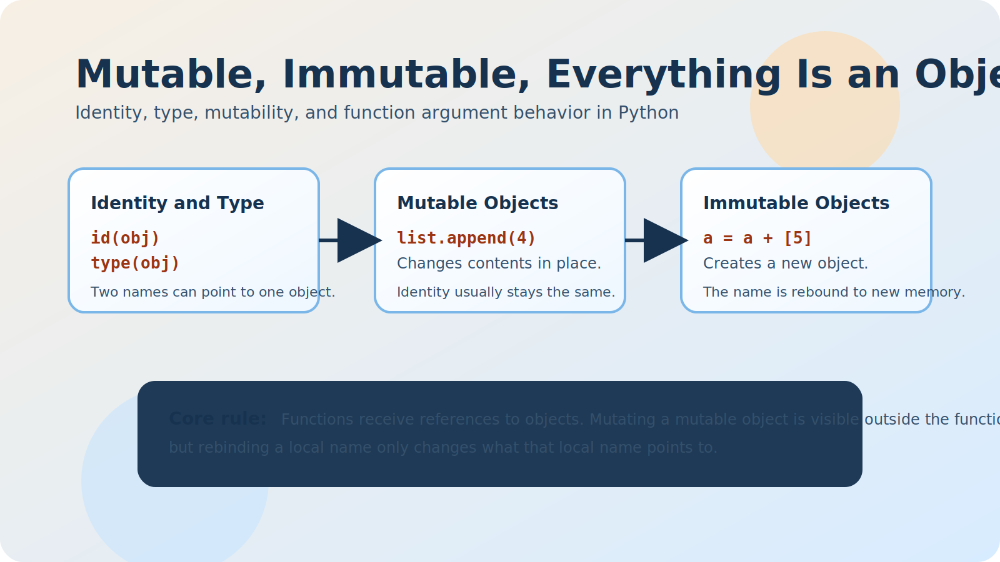

# Mutable, Immutable, Everything Is an Object in Python

## Introduction
One of the biggest mindset shifts in Python is realizing that variables do not store raw values the way many beginners imagine; they store references to objects, and those objects have a type, an identity, and rules about whether their contents can change. This project forced me to stop thinking in terms of "boxes that hold values" and start thinking in terms of "names bound to objects," which immediately explains why `==` and `is` are different, why some operations mutate data in place, why others create a new object, and why function calls can sometimes change an argument outside the function and sometimes not.

```python
a = 89
b = a
print(a == b)
print(a is b)
```

```text
True
True
```

## id and type
Two built-ins make Python's object model much easier to inspect: `type()` tells me what kind of object I am working with, and `id()` gives me that object's identifier, which in CPython corresponds to its memory address for the lifetime of the object. Once I started printing both, I could see that two names may have equal values while still pointing to different objects, or they may point to the exact same object, and that difference is the whole reason `==` and `is` exist as separate operations.

```python
s1 = "Best School"
s2 = "Best School"
print(type(s1))
print(s1 == s2)
print(s1 is s2)
print(id(s1))
print(id(s2))
```

```text
<class 'str'>
True
True or False depending on optimization details
140...
140...
```

```python
l1 = [1, 2, 3]
l2 = [1, 2, 3]
print(type(l1))
print(l1 == l2)
print(l1 is l2)
```

```text
<class 'list'>
True
False
```

## Mutable objects
Mutable objects can change after they are created, which means the object's identity can stay the same while its internal state changes; lists are the clearest example from this project. If two variables point to the same list and one of them mutates it with `append`, `extend`, or item assignment, the other variable sees the change too because both names still refer to the same underlying object.

```python
l1 = [1, 2, 3]
l2 = l1
print(id(l1), id(l2))
l1.append(4)
print(l1)
print(l2)
print(l1 is l2)
```

```text
139... 139...
[1, 2, 3, 4]
[1, 2, 3, 4]
True
```

```python
a = [1, 2, 3]
print(id(a))
a += [4]
print(id(a))
print(a)
```

```text
139...
139...
[1, 2, 3, 4]
```

## Immutable objects
Immutable objects cannot be changed in place, so what looks like a modification is usually the creation of a new object followed by rebinding the variable name; integers, strings, and tuples behave this way. That is why `n += 1` inside a function does not change the caller's integer, why `a = a + [5]` gives a list a new identity even though `a += [4]` does not, and why tuple identity questions can be tricky because Python may reuse constant immutable objects as an optimization even though the conceptual model is still that immutability prevents in-place modification.

```python
a = 1
print(id(a))
a += 1
print(id(a))
print(a)
```

```text
139...
139...  # different from above
2
```

```python
a = [1, 2, 3, 4]
print(id(a))
a = a + [5]
print(id(a))
print(a)
```

```text
139...
140...  # different from above
[1, 2, 3, 4, 5]
```

```python
t1 = (1, 2)
t2 = (1, 2)
print(t1 == t2)
print(t1 is t2)
```

```text
True
Implementation-dependent in small examples, but conceptually not something to rely on
```

## Why it matters and how differently Python treats mutable and immutable objects
This matters because bugs in Python often come from assuming that "same value" means "same object" or assuming that every update happens in place, and neither assumption is safe. Mutable objects are treated as containers whose contents can be changed through any reference to them, while immutable objects are treated as fixed values that must be replaced rather than edited; once that distinction is clear, it becomes much easier to predict aliasing bugs, choose safe default patterns, understand copying, and explain why `copy_list(a_list)` can return `a_list[:]` to create a new list object with the same elements.

```python
my_list = [1, 2, 3]
new_list = my_list[:]
print(new_list == my_list)
print(new_list is my_list)
```

```text
True
False
```

```python
s1 = "Best"
s2 = s1
print(s1 == s2)
print(s1 is s2)
```

```text
True
True
```

## How arguments are passed to functions and what that implies for mutable and immutable objects
Python passes arguments by object reference, which means a function receives access to the same object the caller passed, but the local parameter name is still just a local name; if the function mutates a mutable object, the caller sees the change, and if the function only rebinds the parameter to a different object, the caller sees nothing. That single rule explains all of the function exercises in this project and is the cleanest way I know to describe Python's argument behavior without using misleading phrases like "pass by value" or "pass by reference" in the C++ sense.

```python
def increment(n):
    n += 1

a = 1
increment(a)
print(a)
```

```text
1
```

```python
def increment(items):
    items.append(4)

l = [1, 2, 3]
increment(l)
print(l)
```

```text
[1, 2, 3, 4]
```

```python
def assign_value(n, v):
    n = v

l1 = [1, 2, 3]
l2 = [4, 5, 6]
assign_value(l1, l2)
print(l1)
```

```text
[1, 2, 3]
```

## Advanced task takeaways
The most useful advanced takeaway from this project is that identity results for immutable literals can be influenced by CPython optimizations such as interning and constant reuse inside one compiled block, so `is` may appear to "work" in some small experiments while still being the wrong tool for value comparison. In practice, I should use `==` when I want to compare values, reserve `is` for identity checks like `x is None`, and remember that operations such as `a += [4]` and `a = a + [4]` can look similar while producing completely different identity behavior for mutable objects.

```python
print("Best School" == "Best School")
print("Best School" is "Best School")
print((1, 2) == (1, 2))
print((1, 2) is (1, 2))
```

```text
True
Do not rely on this result
True
Do not rely on this result
```

## Publishing URLs
LinkedIn article/post URL: pending manual publication
